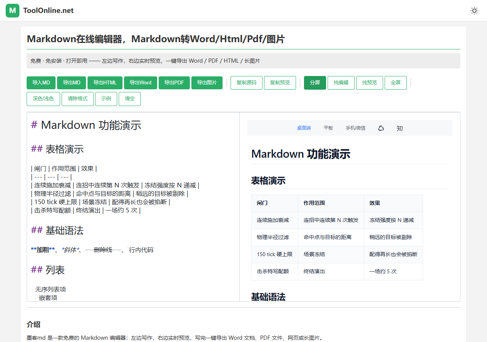
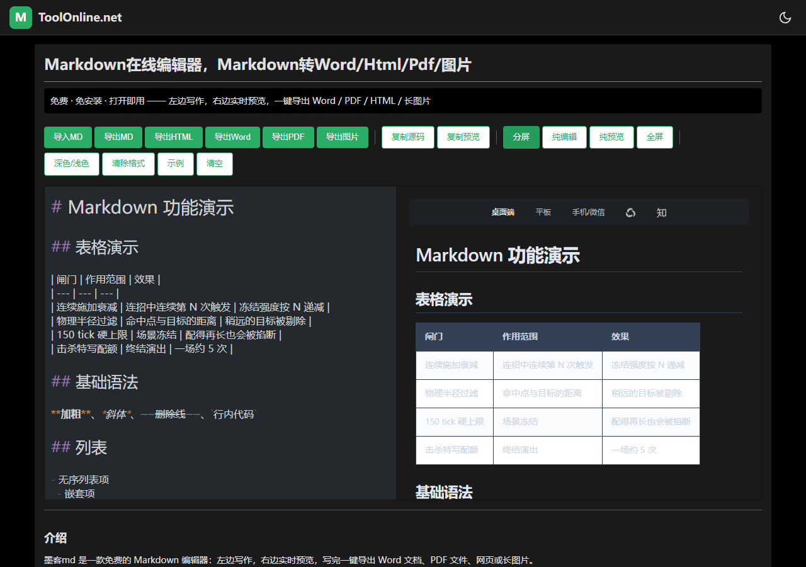

# 墨客md · 免费的 Markdown 编辑器

一个打开就能用的写作小工具：**左边写，右边马上看到排版效果**，写完一键导出 Word、PDF、网页或长图片。

**不需要安装软件，不需要注册登录，所有功能免费。**

## 怎么用？只要 3 步

1. **打开** —— 双击 `index.html` 文件（或打开部署好的网址），推荐用 Chrome / Edge 浏览器
2. **写作** —— 左边输入文字，右边实时显示效果；有现成文章就点「导入MD」打开，不懂语法点「示例」照着写
3. **导出** —— 点上方按钮，把文章存成想要格式，大功告成

> 第一次打开需要联网加载组件，之后写作不受影响。写的内容会**自动保存在你自己的浏览器里**，关掉页面再打开不会丢。

## 每个按钮是干嘛的？

| 按钮 | 作用 |
|------|------|
| 导入MD / 导出MD | 打开、保存 `.md` 文本文件（跨软件通用） |
| 导出HTML | 存成网页文件，双击就能在浏览器里看 |
| 导出Word | 存成 `.doc`，能用 Office / WPS 打开继续编辑 |
| 导出PDF | 弹出打印窗口，在「目标打印机」选**另存为PDF** |
| 导出图片 | 整篇文章生成一张 PNG 长图，适合发帖、分享 |
| 复制源码 / 复制预览 | 复制 Markdown 原文，或复制排好版的富文本（可直接粘贴进公众号、Word） |
| 深色/浅色 | 夜间护眼模式，会记住你的选择 |
| 全屏 | 隐藏其他内容，专心写作 |

还有些贴心功能：

- **自动保存** —— 打字时自动备份，手滑关掉页面内容也在
- **粘贴图片** —— 编辑时直接 Ctrl+V 粘贴截图，自动内嵌进文章，不需要图床
- **语法全家桶** —— 表格、代码高亮、数学公式、任务清单、脚注都支持
- **断网兜底** —— 网络不好时自动切换「简易模式」，写作和导出照常可用

## 常见问题

**我的内容会上传到服务器吗？**
不会。所有内容只存在你自己电脑的浏览器里，不经过任何服务器；换电脑或换浏览器不会自动同步，重要文章记得导出文件保存。

**导出的 PDF 在哪？**
点「导出PDF」会弹出打印预览，在「目标打印机」位置改成「另存为PDF」，点保存就行。

**手机上能用吗？**
能，用手机浏览器打开即可，界面自适应；写作还是建议用电脑，体验最佳。

**下载的压缩包里有什么？**
一个 `index.html`（全部功能都在这一个文件里）和一份 `使用说明.txt`。把 index.html 拷到任何电脑上双击都能用。

## 下载

- 打包好的发行版：到 [Releases 页面](https://github.com/118coder/moke-md/releases) 下载 `墨客md-vX.X.X.zip`
- 只要单文件：直接保存本仓库的 [index.html](https://github.com/118coder/moke-md/blob/main/index.html)（页面右上角下载按钮）

---

开发者 / 技术信息（点开查看更新日志）

基于开源编辑器 [Vditor](https://github.com/Vanessa219/vditor) 构建，单 HTML 文件实现、无构建步骤；更新日志与修复记录见 [CHANGELOG.md](CHANGELOG.md)。

